# HƯỚNG DẪN VẼ USE CASE DIAGRAM - WEBSITE HOLIDATE

## TỔNG QUAN

Tài liệu này hướng dẫn chi tiết cách vẽ Use Case Diagram cho hệ thống Website Holidate, bao gồm các actors, use cases, và các mối quan hệ generalization, include, extend.

---

## 1. ACTORS VÀ GENERALIZATION

### 1.1. **Primary Actors (Human Actors)**

#### **A. Khách hàng (User)**

- **Loại**: Human Actor
- **Mô tả**: Người sử dụng dịch vụ đặt phòng khách sạn
- **Vai trò**: Tìm kiếm, đặt phòng, đánh giá

#### **B. Đối tác Khách sạn (Partner)**

- **Loại**: Human Actor
- **Mô tả**: Người quản lý khách sạn của mình
- **Vai trò**: Quản lý khách sạn, phòng, đặt phòng, báo cáo
- **Generalization**: Kế thừa từ **Khách hàng** (Partner → User)

#### **C. Quản trị viên (Admin)**

- **Loại**: Human Actor
- **Mô tả**: Người quản lý toàn bộ hệ thống
- **Vai trò**: Quản lý hệ thống, người dùng, địa điểm, tiện ích, khuyến mãi
- **Generalization**: Kế thừa từ **Đối tác Khách sạn** (Admin → Partner)
- **Kết quả**: Admin có tất cả quyền của Partner và User

### 1.2. **Secondary Actors (External Systems)**

#### **D. VNPay**

- **Loại**: External System Actor
- **Mô tả**: Hệ thống thanh toán điện tử VNPay
- **Vai trò**: Xử lý thanh toán và hoàn tiền

#### **E. OpenAI API**

- **Loại**: External System Actor
- **Mô tả**: Hệ thống AI cung cấp dịch vụ Chatbot
- **Vai trò**: Xử lý các yêu cầu AI và trả về phản hồi thông minh

### 1.3. **Cấu trúc Generalization và Role Hierarchy**

#### **A. Cấu trúc Generalization trong Use Case Diagram**

```
Khách hàng (User)
      ▲
      │ (Generalization)
      │
Đối tác Khách sạn (Partner)
      ▲
      │ (Generalization)
      │
Quản trị viên (Admin)
```

#### **B. Role Hierarchy trong Code (SecurityConfig.java)**

Role hierarchy được định nghĩa trong `SecurityConfig.java` như sau:

```java
@Bean
RoleHierarchy roleHierarchy() {
    // ADMIN > PARTNER > USER
    return RoleHierarchyImpl.fromHierarchy(
        RoleType.ADMIN.getValue() + " > " + RoleType.PARTNER.getValue() + "\n" +
        RoleType.PARTNER.getValue() + " > " + RoleType.USER.getValue());
}
```

**Cấu trúc Role Hierarchy:**

- **ADMIN > PARTNER**: Admin có tất cả quyền của Partner
- **PARTNER > USER**: Partner có tất cả quyền của User
- **Kết quả**: ADMIN có tất cả quyền của PARTNER và USER (transitive)

#### **C. Giải thích mối quan hệ**

**Trong Use Case Diagram:**

- **Partner → User**: Partner kế thừa tất cả use cases của User (Generalization)
- **Admin → Partner**: Admin kế thừa tất cả use cases của Partner (và gián tiếp có tất cả use cases của User)
- **Hierarchy**: User → Partner → Admin (từ ít quyền đến nhiều quyền)

**Trong Code (Spring Security):**

- Khi một user có role **ADMIN**, Spring Security tự động cấp quyền cho các role **PARTNER** và **USER**
- Khi một user có role **PARTNER**, Spring Security tự động cấp quyền cho role **USER**
- Điều này cho phép Admin và Partner có thể truy cập các endpoints được bảo vệ bởi role thấp hơn trong hierarchy

**Ví dụ:**

- Endpoint yêu cầu `hasAuthority("USER")` → Admin và Partner cũng có thể truy cập
- Endpoint yêu cầu `hasAuthority("PARTNER")` → Admin cũng có thể truy cập
- Endpoint yêu cầu `hasAuthority("ADMIN")` → Chỉ Admin mới có thể truy cập

---

## 2. USE CASES CHÍNH

### 2.1. **Use Cases của Khách hàng (User)**

#### **Nhóm 1: Xác thực và đăng nhập**

1. **Đăng ký tài khoản mới**
2. **Đăng nhập bằng email và mật khẩu**
3. **Đăng nhập bằng Google OAuth2**
4. **Đăng xuất**
5. **Xác thực email (OTP)**
6. **Đặt lại mật khẩu**

#### **Nhóm 2: Quản lý thông tin cá nhân**

7. **Xem thông tin tài khoản**
8. **Cập nhật thông tin cá nhân**

#### **Nhóm 3: Tìm kiếm và khám phá phòng**

9. **Tìm kiếm khách sạn**
10. **Xem danh sách phòng**
11. **Xem chi tiết phòng**
12. **Xem đánh giá khách sạn**
13. **Xem thông tin địa điểm**
14. **Xem tiện ích**
15. **Xem khuyến mãi**
16. **Sử dụng Chatbot AI để tìm phòng**

#### **Nhóm 4: Quản lý đặt phòng**

17. **Tạo đặt phòng mới**
18. **Xem trước giá trước khi đặt**
19. **Xem danh sách đặt phòng**
20. **Xem chi tiết đặt phòng**
21. **Hủy đặt phòng**
22. **Đổi lịch đặt phòng**
23. **Thanh toán**
24. **Thực hiện check-in**
25. **Thực hiện check-out**

#### **Nhóm 5: Quản lý đánh giá**

26. **Viết đánh giá**
27. **Chỉnh sửa đánh giá**
28. **Xóa đánh giá**

### 2.2. **Use Cases của Đối tác Khách sạn (Partner)**

**Lưu ý**: Partner kế thừa tất cả use cases của User (trừ "Đăng ký tài khoản mới"), và có thêm các use cases sau:

#### **Nhóm 6: Xác thực và đăng nhập (Partner)**

29. **Đăng nhập bằng email và mật khẩu** (kế thừa từ User)
30. **Đăng nhập bằng Google OAuth2** (kế thừa từ User)
31. **Đăng xuất** (kế thừa từ User)
32. **Đặt lại mật khẩu** (kế thừa từ User)
33. **Lưu ý**: Partner không thể tự đăng ký, chỉ Admin mới có quyền tạo tài khoản Partner

#### **Nhóm 7: Quản lý khách sạn (Partner)**

34. **Cập nhật thông tin khách sạn**

#### **Nhóm 8: Quản lý phòng (Partner)**

35. **Tạo phòng mới**
36. **Cập nhật thông tin phòng**
37. **Xóa phòng**

#### **Nhóm 9: Quản lý kho phòng (Partner)**

38. **Xem thông tin kho phòng**
39. **Tạo bản ghi kho phòng**
40. **Cập nhật thông tin kho phòng**
41. **Xóa bản ghi kho phòng**

#### **Nhóm 10: Quản lý đặt phòng (Partner - mở rộng)**

42. **Xóa đặt phòng** (User không có quyền này)
43. **Hoàn tiền**

**Lưu ý về Check-in và Check-out:**

- **Check-in và Check-out** là use cases được kế thừa từ User (thông qua generalization)
- **Vai trò khác nhau**:
  - **User**: Tự thực hiện check-in/check-out bằng cách đưa mã booking
  - **Partner**: Thực hiện check-in/check-out cho khách bằng cách xử lý mã booking từ user
- **Trong Use Case Diagram**: Chỉ vẽ association từ User đến Check-in/Check-out
- **Partner tự động có quyền** thực hiện check-in/check-out thông qua generalization (không cần vẽ lại association)

#### **Nhóm 11: Báo cáo và phân tích khách sạn (Partner)**

44. **Xem báo cáo doanh thu khách sạn**
45. **Xem thống kê đặt phòng khách sạn**
46. **Xem phân tích hiệu suất phòng**
47. **Xuất báo cáo khách sạn**

#### **Nhóm 12: Gửi yêu cầu (Partner)**

48. **Gửi yêu cầu tạo khách sạn mới**
49. **Gửi yêu cầu tạo khuyến mãi**
50. **Xem trạng thái yêu cầu**

### 2.3. **Use Cases của Quản trị viên (Admin)**

**Lưu ý**: Admin kế thừa tất cả use cases của Partner và User (trừ "Đăng ký tài khoản mới"), và có thêm các use cases sau:

#### **Nhóm 13: Xác thực và đăng nhập (Admin)**

51. **Đăng nhập bằng email và mật khẩu** (kế thừa từ User)
52. **Đăng nhập bằng Google OAuth2** (kế thừa từ User)
53. **Đăng xuất** (kế thừa từ User)
54. **Đặt lại mật khẩu** (kế thừa từ User)
55. **Lưu ý**: Tài khoản Admin được tạo tự động khi khởi động hệ thống hoặc do Admin khác tạo

#### **Nhóm 14: Quản lý người dùng và vai trò (Admin)**

56. **Xem danh sách người dùng**
57. **Xem chi tiết người dùng**
58. **Tạo tài khoản người dùng** (có thể tạo với role User, Partner hoặc Admin)
59. **Cập nhật thông tin người dùng**
60. **Xóa tài khoản người dùng**
61. **Quản lý vai trò**

#### **Nhóm 15: Quản lý địa điểm (Admin)**

62. **Xem danh sách địa điểm**
63. **Tạo địa điểm mới**
64. **Cập nhật thông tin địa điểm**
65. **Xóa địa điểm**

#### **Nhóm 16: Quản lý khách sạn (Admin - mở rộng)**

66. **Tạo khách sạn mới** (chỉ Admin có quyền này)
67. **Xóa khách sạn** (chỉ Admin có quyền này)

#### **Nhóm 17: Quản lý tiện ích (Admin)**

68. **Xem danh sách tiện ích**
69. **Tạo tiện ích mới**
70. **Cập nhật thông tin tiện ích**
71. **Xóa tiện ích**
72. **Quản lý danh mục tiện ích**

#### **Nhóm 18: Quản lý ngày đặc biệt (Admin)**

73. **Xem danh sách ngày đặc biệt**
74. **Tạo ngày đặc biệt mới**
75. **Cập nhật thông tin ngày đặc biệt**
76. **Xóa ngày đặc biệt**

#### **Nhóm 19: Quản lý khuyến mãi (Admin)**

77. **Xem danh sách khuyến mãi**
78. **Tạo khuyến mãi mới**
79. **Cập nhật thông tin khuyến mãi**
80. **Xóa khuyến mãi**

#### **Nhóm 20: Quản lý đặt phòng (Admin - mở rộng)**

81. **Chỉnh sửa đặt phòng** (chỉ Admin có quyền này)

#### **Nhóm 21: Báo cáo và phân tích toàn hệ thống (Admin)**

82. **Xem báo cáo doanh thu toàn hệ thống**
83. **Xem thống kê đặt phòng toàn hệ thống**
84. **Xem phân tích hiệu suất khách sạn**
85. **Xem thống kê người dùng**
86. **Xem phân tích đánh giá toàn hệ thống**
87. **Xuất báo cáo toàn hệ thống**

#### **Nhóm 22: Xử lý yêu cầu từ đối tác (Admin)**

88. **Xem danh sách yêu cầu từ đối tác**
89. **Xem chi tiết yêu cầu**
90. **Duyệt yêu cầu**
91. **Từ chối yêu cầu**
92. **Xem lịch sử xử lý yêu cầu**

#### **Nhóm 23: Quản lý Chatbot AI (Admin)**

93. **Xem các cuộc trò chuyện với Chatbot**
94. **Phân tích hiệu quả Chatbot**
95. **Cấu hình Chatbot AI**
96. **Xem báo cáo Chatbot**

### 2.4. **Use Cases của VNPay (External System)**

97. **Nhận yêu cầu thanh toán**
98. **Gửi kết quả thanh toán (callback)**
99. **Xử lý hoàn tiền**

### 2.5. **Use Cases của OpenAI API (External System)**

100. **Nhận yêu cầu xử lý AI**
101. **Xử lý câu hỏi từ khách hàng**
102. **Trả về phản hồi AI**

---

## 3. MỐI QUAN HỆ INCLUDE (<<include>>)

### 3.1. **Định nghĩa Include**

**Include** là mối quan hệ bắt buộc: Use case A luôn phải thực hiện Use case B như một phần của nó.

**Ký hiệu UML**: `A <<include>> B` (mũi tên từ A đến B, có nhãn `<<include>>`)

### 3.2. **Các mối quan hệ Include trong hệ thống**

#### **A. Quản lý đặt phòng**

1. **Tạo đặt phòng mới <<include>> Xem trước giá trước khi đặt**

   - **Lý do**: Khi tạo đặt phòng, hệ thống luôn phải tính và hiển thị giá trước
   - **Từ code**: `BookingService.create()` luôn gọi `calculatePrice()` trước khi tạo booking

2. **Tạo đặt phòng mới <<include>> Thanh toán**

   - **Lý do**: Sau khi tạo đặt phòng, hệ thống luôn phải tạo payment và redirect đến VNPay
   - **Từ code**: `BookingService.create()` luôn gọi `PaymentService.createPaymentUrl()` sau khi tạo booking

3. **Đổi lịch đặt phòng <<include>> Xem trước giá trước khi đặt**

   - **Lý do**: Khi đổi lịch, hệ thống phải tính lại giá (có thể thay đổi do giá phòng khác nhau theo ngày)
   - **Từ code**: `BookingService.reschedule()` tính lại giá sau khi thay đổi ngày
   - **Lưu ý**: "Thanh toán phí đổi lịch" là extend, không phải include (xem phần Extend)

#### **B. Quản lý khách sạn và phòng**

6. **Cập nhật thông tin phòng <<include>> Đăng nhập**

   - **Lý do**: Trước khi cập nhật thông tin phòng, Partner phải đăng nhập (xác thực bắt buộc)
   - **Từ code**: SecurityConfig yêu cầu authentication cho các endpoint cập nhật
   - **Lưu ý**: "Xem chi tiết phòng" là extend, không phải include (xem phần Extend)

7. **Cập nhật thông tin khách sạn <<include>> Đăng nhập**

   - **Lý do**: Trước khi cập nhật thông tin khách sạn, Partner phải đăng nhập (xác thực bắt buộc)
   - **Từ code**: SecurityConfig yêu cầu authentication cho các endpoint cập nhật

8. **Tạo phòng mới <<include>> Tạo bản ghi kho phòng**

   - **Lý do**: Khi tạo phòng mới, hệ thống phải tạo bản ghi kho phòng ban đầu
   - **Hoặc**: Có thể tách riêng, nhưng thông thường khi tạo phòng cần thiết lập kho phòng

#### **C. Quản lý đánh giá**

9. **Viết đánh giá <<include>> Xác thực đã sử dụng dịch vụ**
   - **Lý do**: Chỉ khách hàng đã check-out mới có thể viết đánh giá
   - **Lưu ý**: Đây có thể là logic bên trong, không cần thể hiện trong use case diagram

#### **D. Thanh toán**

10. **Thanh toán <<include>> Xác thực đặt phòng**

- **Lý do**: Trước khi thanh toán, hệ thống phải xác thực đặt phòng tồn tại và hợp lệ
- **Lưu ý**: Đây có thể là logic bên trong, không cần thể hiện trong use case diagram

11. **Thanh toán <<include>> Gửi email xác nhận**
    - **Lý do**: Sau khi thanh toán thành công, hệ thống luôn gửi email xác nhận
    - **Từ code**: `PaymentService.handleVnPayCallback()` gọi `sendBookingConfirmationEmail()`

#### **E. Xác thực và đăng nhập**

12. **Đăng ký tài khoản mới <<include>> Xác thực email**

    - **Lý do**: Khi đăng ký, hệ thống phải xác thực email bằng OTP
    - **Từ code**: Hệ thống có OTP verification cho email

13. **Đăng nhập <<include>> Xác thực thông tin đăng nhập**

    - **Lý do**: Khi đăng nhập, hệ thống phải xác thực email và mật khẩu
    - **Lưu ý**: Đây có thể là logic bên trong, không cần thể hiện trong use case diagram

14. **Đăng nhập <<include>> Tạo token**

    - **Lý do**: Sau khi đăng nhập thành công, hệ thống luôn tạo access token và refresh token
    - **Từ code**: `AuthService.login()` luôn tạo token sau khi xác thực thành công

15. **Đăng xuất <<include>> Vô hiệu hóa token**
    - **Lý do**: Khi đăng xuất, hệ thống phải vô hiệu hóa refresh token
    - **Từ code**: `AuthService.logout()` lưu token vào InvalidToken table

---

## 4. MỐI QUAN HỆ EXTEND (<<extend>>)

### 4.1. **Định nghĩa Extend**

**Extend** là mối quan hệ tùy chọn: Use case A có thể được mở rộng bởi Use case B trong một số điều kiện nhất định.

**Ký hiệu UML**: `B <<extend>> A` (mũi tên từ B đến A, có nhãn `<<extend>>`)

**Lưu ý**: Mũi tên extend chỉ từ use case mở rộng đến use case gốc.

### 4.2. **Các mối quan hệ Extend trong hệ thống**

#### **A. Tìm kiếm và khám phá phòng**

1. **Sử dụng Chatbot AI để tìm phòng <<extend>> Tìm kiếm khách sạn**

   - **Lý do**: Người dùng có thể sử dụng Chatbot AI để tìm phòng thay vì tìm kiếm thông thường
   - **Điều kiện**: Người dùng chọn sử dụng Chatbot AI
   - **Từ tài liệu**: "Chatbot AI hỗ trợ tìm kiếm phòng"
   - **Lưu ý**: Chatbot AI là use case mở rộng (extension) của Tìm kiếm khách sạn, mũi tên từ "Sử dụng Chatbot AI" đến "Tìm kiếm khách sạn"

2. **Sử dụng Chatbot AI để tìm phòng <<extend>> Xem chi tiết phòng**
   - **Lý do**: Người dùng có thể hỏi Chatbot về chi tiết phòng khi đang xem chi tiết
   - **Điều kiện**: Người dùng đang xem chi tiết phòng và chọn hỏi Chatbot
   - **Lưu ý**: Chatbot AI có thể mở rộng nhiều use case khác nhau (Tìm kiếm, Xem chi tiết phòng, v.v.)

#### **B. Quản lý đặt phòng**

3. **Áp dụng khuyến mãi <<extend>> Tạo đặt phòng mới**

   - **Lý do**: Người dùng có thể (tùy chọn) áp dụng mã khuyến mãi khi tạo đặt phòng
   - **Điều kiện**: Người dùng có mã khuyến mãi và nhập vào
   - **Từ code**: `BookingCreationRequest` có trường `discountCode` (optional)
   - **Lưu ý**: Áp dụng khuyến mãi là use case mở rộng (extension) của Tạo đặt phòng mới, mũi tên từ "Áp dụng khuyến mãi" đến "Tạo đặt phòng mới"

4. **Hoàn tiền <<extend>> Hủy đặt phòng**

   - **Lý do**: Khi hủy đặt phòng, hệ thống có thể hoàn tiền (nếu đã thanh toán và trong thời gian cho phép)
   - **Điều kiện**:
     - Đặt phòng đã thanh toán
     - Trong thời gian được phép hoàn tiền (theo chính sách hủy)
   - **Lưu ý**: Hoàn tiền là use case mở rộng (extension) của Hủy đặt phòng, mũi tên từ "Hoàn tiền" đến "Hủy đặt phòng". Đây là extend vì không phải lúc nào hủy cũng hoàn tiền (có thể quá hạn)

5. **Thanh toán phí đổi lịch <<extend>> Đổi lịch đặt phòng**
   - **Lý do**: Khi đổi lịch, có thể phải trả phí đổi lịch (nếu có)
   - **Điều kiện**:
     - Có phí đổi lịch (reschedule fee)
     - Người dùng chấp nhận trả phí
   - **Từ code**: `BookingService.reschedule()` tính reschedule fee nếu có
   - **Lưu ý**: Thanh toán phí đổi lịch là use case mở rộng (extension) của Đổi lịch đặt phòng, mũi tên từ "Thanh toán phí đổi lịch" đến "Đổi lịch đặt phòng"

#### **C. Quản lý khách sạn**

6. **Upload hình ảnh <<extend>> Cập nhật thông tin khách sạn**

   - **Lý do**: Khi cập nhật thông tin khách sạn, Partner có thể (tùy chọn) upload hình ảnh mới
   - **Điều kiện**: Partner chọn upload hình ảnh
   - **Lưu ý**: Upload hình ảnh là use case mở rộng (extension) của Cập nhật thông tin khách sạn, mũi tên từ "Upload hình ảnh" đến "Cập nhật thông tin khách sạn"

7. **Upload hình ảnh phòng <<extend>> Tạo phòng mới**

   - **Lý do**: Khi tạo phòng, Partner có thể (tùy chọn) upload hình ảnh phòng
   - **Điều kiện**: Partner chọn upload hình ảnh
   - **Lưu ý**: Upload hình ảnh phòng là use case mở rộng (extension) của Tạo phòng mới, mũi tên từ "Upload hình ảnh phòng" đến "Tạo phòng mới"

8. **Xem chi tiết phòng <<extend>> Cập nhật thông tin phòng**
   - **Lý do**: Khi cập nhật thông tin phòng, Partner có thể (tùy chọn) xem lại chi tiết phòng trước khi cập nhật
   - **Điều kiện**: Partner chọn xem chi tiết phòng trước khi cập nhật
   - **Lưu ý**: Xem chi tiết phòng là use case mở rộng (extension) của Cập nhật thông tin phòng, mũi tên từ "Xem chi tiết phòng" đến "Cập nhật thông tin phòng". Partner đã kế thừa "Xem chi tiết phòng" từ User

#### **D. Báo cáo và phân tích**

9. **Xuất báo cáo dưới dạng file <<extend>> Xem báo cáo doanh thu**

   - **Lý do**: Sau khi xem báo cáo, người dùng có thể (tùy chọn) xuất file PDF/Excel
   - **Điều kiện**: Người dùng chọn xuất file
   - **Từ tài liệu**: "Xuất báo cáo dưới dạng file (PDF, Excel)"
   - **Lưu ý**: Xuất báo cáo là use case mở rộng (extension) của Xem báo cáo doanh thu, mũi tên từ "Xuất báo cáo dưới dạng file" đến "Xem báo cáo doanh thu"

10. **Xuất báo cáo dưới dạng file <<extend>> Xem thống kê đặt phòng**

- **Lý do**: Tương tự như trên
- **Lưu ý**: Xuất báo cáo có thể mở rộng nhiều use case xem báo cáo khác nhau

#### **E. Quản lý đánh giá**

11. **Lọc đánh giá theo điểm số <<extend>> Xem đánh giá khách sạn**

    - **Lý do**: Người dùng có thể (tùy chọn) lọc đánh giá theo điểm số
    - **Điều kiện**: Người dùng chọn lọc theo điểm số
    - **Từ tài liệu**: "Lọc đánh giá theo điểm số (từ điểm tối thiểu đến tối đa)"
    - **Lưu ý**: Lọc đánh giá là use case mở rộng (extension) của Xem đánh giá khách sạn, mũi tên từ "Lọc đánh giá theo điểm số" đến "Xem đánh giá khách sạn"

12. **Sắp xếp đánh giá <<extend>> Xem đánh giá khách sạn**
    - **Lý do**: Người dùng có thể (tùy chọn) sắp xếp đánh giá
    - **Điều kiện**: Người dùng chọn sắp xếp
    - **Từ tài liệu**: "Sắp xếp đánh giá theo ngày tạo"
    - **Lưu ý**: Sắp xếp đánh giá là use case mở rộng (extension) của Xem đánh giá khách sạn, mũi tên từ "Sắp xếp đánh giá" đến "Xem đánh giá khách sạn"

#### **F. Tìm kiếm**

13. **Lọc theo hạng sao <<extend>> Tìm kiếm khách sạn**

    - **Lý do**: Người dùng có thể (tùy chọn) lọc kết quả theo hạng sao
    - **Điều kiện**: Người dùng chọn lọc theo hạng sao
    - **Lưu ý**: Lọc theo hạng sao là use case mở rộng (extension) của Tìm kiếm khách sạn, mũi tên từ "Lọc theo hạng sao" đến "Tìm kiếm khách sạn"

14. **Lọc theo tiện ích <<extend>> Tìm kiếm khách sạn**

    - **Lý do**: Người dùng có thể (tùy chọn) lọc kết quả theo tiện ích
    - **Điều kiện**: Người dùng chọn lọc theo tiện ích
    - **Lưu ý**: Lọc theo tiện ích là use case mở rộng (extension) của Tìm kiếm khách sạn, mũi tên từ "Lọc theo tiện ích" đến "Tìm kiếm khách sạn"

15. **Lọc theo khoảng giá <<extend>> Tìm kiếm khách sạn**
    - **Lý do**: Người dùng có thể (tùy chọn) lọc kết quả theo khoảng giá
    - **Điều kiện**: Người dùng chọn lọc theo khoảng giá
    - **Lưu ý**: Lọc theo khoảng giá là use case mở rộng (extension) của Tìm kiếm khách sạn, mũi tên từ "Lọc theo khoảng giá" đến "Tìm kiếm khách sạn"

#### **G. Xác thực**

16. **Đăng nhập bằng Google OAuth2 <<extend>> Đăng nhập**
    - **Lý do**: Người dùng có thể (tùy chọn) đăng nhập bằng Google thay vì email/password
    - **Điều kiện**: Người dùng chọn đăng nhập bằng Google
    - **Từ code**: Hệ thống có OAuth2 integration với Google
    - **Lưu ý**: Đăng nhập bằng Google OAuth2 là use case mở rộng (extension) của Đăng nhập, mũi tên từ "Đăng nhập bằng Google OAuth2" đến "Đăng nhập"

---

## 5. HƯỚNG DẪN VẼ USE CASE DIAGRAM

### 5.1. **Bước 1: Vẽ System Boundary**

1. Vẽ một hình chữ nhật lớn với nhãn "Website Holidate" ở trên cùng
2. Đây là ranh giới của hệ thống, tất cả use cases sẽ nằm bên trong

### 5.2. **Bước 2: Vẽ Actors**

1. **Vẽ Primary Actors (bên trái hệ thống):**

   - Vẽ "Khách hàng" (User) - stick figure
   - Vẽ "Đối tác Khách sạn" (Partner) - stick figure
   - Vẽ "Quản trị viên" (Admin) - stick figure

2. **Vẽ Secondary Actors (bên phải hệ thống):**

   - Vẽ "VNPay" - stick figure (có thể thêm <<external system>>)
   - Vẽ "OpenAI API" - stick figure (có thể thêm <<external system>>)

3. **Vẽ Generalization:**
   - Vẽ mũi tên từ "Đối tác Khách sạn" đến "Khách hàng" (hollow triangle arrow)
   - Vẽ mũi tên từ "Quản trị viên" đến "Đối tác Khách sạn" (hollow triangle arrow)
   - **Lưu ý**: Mũi tên generalization có đầu mũi tên rỗng (hollow triangle) và chỉ từ child đến parent

### 5.3. **Bước 3: Vẽ Use Cases**

1. **Vẽ Use Cases bên trong System Boundary:**

   - Vẽ các use cases dưới dạng hình oval
   - Nhóm các use cases theo chức năng để dễ đọc
   - Sử dụng tên ngắn gọn, rõ ràng

2. **Các nhóm Use Cases chính:**
   - **Nhóm Xác thực và đăng nhập**: Đăng ký, Đăng nhập, Đăng xuất, Xác thực email, Đặt lại mật khẩu
   - **Nhóm Quản lý thông tin cá nhân**: Xem thông tin tài khoản, Cập nhật thông tin cá nhân
   - **Nhóm Tìm kiếm**: Tìm kiếm khách sạn, Xem danh sách phòng, Xem chi tiết phòng, Xem đánh giá, Sử dụng Chatbot AI
   - **Nhóm Quản lý đặt phòng**: Tạo đặt phòng, Xem trước giá, Hủy đặt phòng, Đổi lịch đặt phòng, Thanh toán, Check-in, Check-out
   - **Nhóm Quản lý khách sạn**: Cập nhật thông tin khách sạn, Tạo khách sạn, Xóa khách sạn
   - **Nhóm Quản lý phòng**: Tạo phòng, Cập nhật phòng, Xóa phòng
   - **Nhóm Quản lý kho phòng**: Xem kho phòng, Tạo bản ghi kho phòng, Cập nhật kho phòng
   - **Nhóm Quản lý đánh giá**: Viết đánh giá, Chỉnh sửa đánh giá, Xóa đánh giá
   - **Nhóm Báo cáo**: Xem báo cáo doanh thu, Xem thống kê, Xuất báo cáo
   - **Nhóm Quản lý hệ thống (Admin)**: Quản lý người dùng, Quản lý địa điểm, Quản lý tiện ích, Quản lý khuyến mãi

### 5.4. **Bước 4: Vẽ Associations (Actor - Use Case)**

1. **Vẽ đường thẳng từ Actor đến Use Case:**

   - **Khách hàng (User)** → Tất cả use cases của User (bao gồm Đăng ký tài khoản mới, Check-in, Check-out, v.v.)
   - **Đối tác Khách sạn (Partner)** → CHỈ vẽ associations đến các use cases riêng của Partner (KHÔNG vẽ lại các use cases của User)
   - **Quản trị viên (Admin)** → CHỈ vẽ associations đến các use cases riêng của Admin (KHÔNG vẽ lại các use cases của User và Partner)
   - **VNPay** → Nhận yêu cầu thanh toán, Gửi kết quả thanh toán, Xử lý hoàn tiền
   - **OpenAI API** → Nhận yêu cầu xử lý AI, Xử lý câu hỏi, Trả về phản hồi AI

2. **Lưu ý QUAN TRỌNG về Generalization:**

   - **KHÔNG CẦN vẽ lại associations** từ Partner/Admin đến các use cases của User
   - **Generalization tự động cấp** cho Partner và Admin tất cả use cases của User
   - **Chỉ vẽ associations** đến các use cases riêng của từng actor
   - **Ví dụ**: Check-in và Check-out là use cases của User → Chỉ vẽ `User --> CheckIn` và `User --> CheckOut`
     - **KHÔNG vẽ** `Partner --> CheckIn` hoặc `Partner --> CheckOut` (vì Partner đã kế thừa từ User)
     - Partner tự động có quyền thực hiện Check-in và Check-out thông qua generalization

3. **Ví dụ cụ thể về Check-in và Check-out:**

   - **Use Case**: "Thực hiện check-in" và "Thực hiện check-out" là use cases chung cho cả User và Partner
   - **Vai trò khác nhau**:
     - **User**: Tự thực hiện check-in/check-out bằng cách đưa mã booking
     - **Partner**: Thực hiện check-in/check-out cho khách bằng cách xử lý mã booking
   - **Trong Diagram**: Chỉ vẽ `User --> CheckIn` và `User --> CheckOut`
   - **Partner tự động có quyền** thực hiện check-in/check-out thông qua generalization (không cần vẽ lại)

### 5.5. **Bước 5: Vẽ Include Relationships**

1. **Vẽ mũi tên từ Use Case A đến Use Case B với nhãn <<include>>:**

   - Mũi tên có mũi tên đầy (solid arrow) và đường nét đứt (dashed line)
   - Nhãn `<<include>>` đặt gần mũi tên

2. **Các Include Relationships chính:**
   - Đăng ký tài khoản mới → Xác thực email
   - Đăng nhập → Tạo token
   - Đăng xuất → Vô hiệu hóa token
   - Tạo đặt phòng mới → Xem trước giá trước khi đặt
   - Tạo đặt phòng mới → Thanh toán
   - Đổi lịch đặt phòng → Xem trước giá trước khi đặt
   - Thanh toán → Gửi email xác nhận
   - Tạo phòng mới → Tạo bản ghi kho phòng
   - Cập nhật thông tin phòng → Đăng nhập
   - Cập nhật thông tin khách sạn → Đăng nhập
   - **Lưu ý**: Mũi tên include đi từ use case chính đến use case được include

### 5.6. **Bước 6: Vẽ Extend Relationships**

1. **Vẽ mũi tên từ Use Case B đến Use Case A với nhãn <<extend>>:**

   - Mũi tên có mũi tên đầy (solid arrow) và đường nét đứt (dashed line)
   - Nhãn `<<extend>>` đặt gần mũi tên
   - **Lưu ý**: Mũi tên extend chỉ từ use case mở rộng đến use case gốc

2. **Các Extend Relationships chính:**

   - Sử dụng Chatbot AI → Tìm kiếm khách sạn
   - Sử dụng Chatbot AI → Xem chi tiết phòng
   - Áp dụng khuyến mãi → Tạo đặt phòng mới
   - Hoàn tiền → Hủy đặt phòng [nếu đã thanh toán]
   - Thanh toán phí đổi lịch → Đổi lịch đặt phòng [nếu có phí]
   - Upload hình ảnh → Cập nhật thông tin khách sạn
   - Upload hình ảnh phòng → Tạo phòng mới
   - Xuất báo cáo → Xem báo cáo doanh thu
   - Xuất báo cáo → Xem thống kê đặt phòng
   - Lọc đánh giá theo điểm số → Xem đánh giá khách sạn
   - Sắp xếp đánh giá → Xem đánh giá khách sạn
   - Lọc theo hạng sao → Tìm kiếm khách sạn
   - Lọc theo tiện ích → Tìm kiếm khách sạn
   - Lọc theo khoảng giá → Tìm kiếm khách sạn
   - Đăng nhập bằng Google OAuth2 → Đăng nhập
   - Xem chi tiết phòng → Cập nhật thông tin phòng (Partner có thể xem trước khi cập nhật)
   - **Lưu ý**: Mũi tên extend đi từ use case mở rộng (extension) đến use case gốc (base)

3. **Lưu ý về Extend:**
   - Có thể thêm điều kiện (condition) trong ngoặc vuông: `[điều kiện]`
   - Ví dụ: `Hoàn tiền <<extend>> Hủy đặt phòng [nếu đã thanh toán]`

---

## 6. SƠ ĐỒ USE CASE DIAGRAM TỔNG QUAN

### 6.1. **Cấu trúc tổng quan**

```
┌─────────────────────────────────────────────────────────────────┐
│                    WEBSITE HOLIDATE                             │
│                                                                 │
│  ┌──────────────────────────────────────────────────────────┐  │
│  │  Use Cases của User                                      │  │
│  │  - Xem thông tin tài khoản                              │  │
│  │  - Cập nhật thông tin cá nhân                           │  │
│  │  - Tìm kiếm khách sạn                                   │  │
│  │  - Xem danh sách phòng                                  │  │
│  │  - Xem chi tiết phòng                                   │  │
│  │  - Tạo đặt phòng mới                                    │  │
│  │  - Hủy đặt phòng                                        │  │
│  │  - Đổi lịch đặt phòng                                   │  │
│  │  - Thanh toán                                           │  │
│  │  - Viết đánh giá                                        │  │
│  │  - ...                                                  │  │
│  └──────────────────────────────────────────────────────────┘  │
│                                                                 │
│  ┌──────────────────────────────────────────────────────────┐  │
│  │  Use Cases của Partner (thêm vào)                        │  │
│  │  - Cập nhật thông tin khách sạn                         │  │
│  │  - Tạo phòng mới                                        │  │
│  │  - Quản lý kho phòng                                    │  │
│  │  - Xóa đặt phòng                                        │  │
│  │  - Hoàn tiền                                            │  │
│  │  - Xem báo cáo khách sạn                                │  │
│  │  - Gửi yêu cầu cho Admin                                │  │
│  │  - ...                                                  │  │
│  └──────────────────────────────────────────────────────────┘  │
│                                                                 │
│  ┌──────────────────────────────────────────────────────────┐  │
│  │  Use Cases của Admin (thêm vào)                          │  │
│  │  - Quản lý người dùng và vai trò                        │  │
│  │  - Quản lý địa điểm                                     │  │
│  │  - Tạo khách sạn mới                                    │  │
│  │  - Xóa khách sạn                                        │  │
│  │  - Quản lý tiện ích                                     │  │
│  │  - Quản lý khuyến mãi                                   │  │
│  │  - Chỉnh sửa đặt phòng                                  │  │
│  │  - Xử lý yêu cầu từ đối tác                             │  │
│  │  - Quản lý Chatbot AI                                   │  │
│  │  - Xem báo cáo toàn hệ thống                            │  │
│  │  - ...                                                  │  │
│  └──────────────────────────────────────────────────────────┘  │
│                                                                 │
│  ┌──────────────────────────────────────────────────────────┐  │
│  │  Use Cases với VNPay                                     │  │
│  │  - Nhận yêu cầu thanh toán                              │  │
│  │  - Gửi kết quả thanh toán                               │  │
│  │  - Xử lý hoàn tiền                                      │  │
│  └──────────────────────────────────────────────────────────┘  │
│                                                                 │
│  ┌──────────────────────────────────────────────────────────┐  │
│  │  Use Cases với OpenAI API                                │  │
│  │  - Nhận yêu cầu xử lý AI                                │  │
│  │  - Xử lý câu hỏi từ khách hàng                          │  │
│  │  - Trả về phản hồi AI                                   │  │
│  └──────────────────────────────────────────────────────────┘  │
└─────────────────────────────────────────────────────────────────┘
         │              │              │              │              │
         │              │              │              │              │
    ┌────┘         ┌────┘         ┌────┘         ┌───┘         ┌───┘
    │              │              │              │              │
┌───▼───┐    ┌─────▼─────┐   ┌────▼────┐   ┌────▼─────┐  ┌────▼────────┐
│Admin  │    │  Partner  │   │  User   │   │  VNPay   │  │ OpenAI API  │
└───┬───┘    └─────┬─────┘   └─────────┘   └──────────┘  └─────────────┘
    │              │
    │              │ (Generalization)
    │              │
    │         ┌────┴────┐
    │         │         │
    │         │    ┌────▼────┐
    │         │    │  User   │
    │         │    └─────────┘
    │         │
    └─────────┘
    (Generalization Chain)
    Partner → User
    Admin → Partner
```

### 6.2. **Ví dụ Include và Extend**

```
Tạo đặt phòng mới
    │
    │ <<include>>
    ▼
Xem trước giá trước khi đặt
    │
    │ <<include>>
    ▼
Thanh toán

Tìm kiếm khách sạn
    ▲
    │ <<extend>>
    │
Sử dụng Chatbot AI để tìm phòng

Hủy đặt phòng
    ▲
    │ <<extend>> [nếu đã thanh toán]
    │
Hoàn tiền
```

---

## 7. VÍ DỤ PLANTUML

### 7.1. **PlantUML Code**

```plantuml
@startuml Holidate Use Case Diagram

!define RECTANGLE class

' Actors
actor User as "Khách hàng"
actor Partner as "Đối tác Khách sạn"
actor Admin as "Quản trị viên"
actor VNPay
actor "OpenAI API" as OpenAI

' Generalization relationships
' Hierarchy: User → Partner → Admin (từ ít quyền đến nhiều quyền)
' Phản ánh Role Hierarchy trong SecurityConfig.java: ADMIN > PARTNER > USER
User <|-- Partner
Partner <|-- Admin

' System boundary
rectangle "Website Holidate" {
    ' User use cases
    (Đăng ký tài khoản mới) as UC_Register
    (Đăng nhập bằng email và mật khẩu) as UC_Login
    (Đăng nhập bằng Google OAuth2) as UC_LoginGoogle
    (Đăng xuất) as UC_Logout
    (Xác thực email) as UC_VerifyEmail
    (Đặt lại mật khẩu) as UC_ResetPassword
    (Xem thông tin tài khoản) as UC_ViewProfile
    (Cập nhật thông tin cá nhân) as UC_UpdateProfile
    (Tìm kiếm khách sạn) as UC_SearchHotel
    (Xem danh sách phòng) as UC_ViewRooms
    (Xem chi tiết phòng) as UC_ViewRoomDetail
    (Xem đánh giá khách sạn) as UC_ViewReviews
    (Tạo đặt phòng mới) as UC_CreateBooking
    (Xem trước giá trước khi đặt) as UC_PricePreview
    (Xem danh sách đặt phòng) as UC_ViewBookings
    (Xem chi tiết đặt phòng) as UC_ViewBookingDetail
    (Hủy đặt phòng) as UC_CancelBooking
    (Đổi lịch đặt phòng) as UC_RescheduleBooking
    (Thanh toán) as UC_Payment
    (Thực hiện check-in) as UC_CheckIn
    (Thực hiện check-out) as UC_CheckOut
    (Viết đánh giá) as UC_WriteReview
    (Chỉnh sửa đánh giá) as UC_EditReview
    (Xóa đánh giá) as UC_DeleteReview
    (Sử dụng Chatbot AI để tìm phòng) as UC_Chatbot

    ' Partner use cases (additional)
    (Cập nhật thông tin khách sạn) as UC_UpdateHotel
    (Tạo phòng mới) as UC_CreateRoom
    (Cập nhật thông tin phòng) as UC_UpdateRoom
    (Xóa phòng) as UC_DeleteRoom
    (Xem thông tin kho phòng) as UC_ViewInventory
    (Tạo bản ghi kho phòng) as UC_CreateInventory
    (Cập nhật thông tin kho phòng) as UC_UpdateInventory
    (Xóa đặt phòng) as UC_DeleteBooking
    (Hoàn tiền) as UC_Refund
    (Xem báo cáo doanh thu khách sạn) as UC_HotelReport
    (Xuất báo cáo khách sạn) as UC_ExportHotelReport
    (Gửi yêu cầu cho Admin) as UC_SendRequest

    ' Admin use cases (additional)
    (Quản lý người dùng và vai trò) as UC_ManageUsers
    (Quản lý địa điểm) as UC_ManageLocations
    (Tạo khách sạn mới) as UC_CreateHotel
    (Xóa khách sạn) as UC_DeleteHotel
    (Quản lý tiện ích) as UC_ManageAmenities
    (Quản lý ngày đặc biệt) as UC_ManageSpecialDays
    (Quản lý khuyến mãi) as UC_ManageDiscounts
    (Chỉnh sửa đặt phòng) as UC_EditBooking
    (Xử lý yêu cầu từ đối tác) as UC_ProcessRequests
    (Quản lý Chatbot AI) as UC_ManageChatbot
    (Xem báo cáo toàn hệ thống) as UC_SystemReport
    (Xuất báo cáo toàn hệ thống) as UC_ExportSystemReport

    ' External system use cases
    (Nhận yêu cầu thanh toán) as UC_ReceivePayment
    (Gửi kết quả thanh toán) as UC_SendPaymentResult
    (Xử lý hoàn tiền) as UC_ProcessRefund
    (Nhận yêu cầu xử lý AI) as UC_ReceiveAIRequest
    (Xử lý câu hỏi từ khách hàng) as UC_ProcessQuestion
    (Trả về phản hồi AI) as UC_AIResponse
}

' User associations
User --> UC_Register
User --> UC_Login
User --> UC_Logout
User --> UC_VerifyEmail
User --> UC_ResetPassword
User --> UC_ViewProfile
User --> UC_UpdateProfile
User --> UC_SearchHotel
User --> UC_ViewRooms
User --> UC_ViewRoomDetail
User --> UC_ViewReviews
User --> UC_CreateBooking
User --> UC_ViewBookings
User --> UC_ViewBookingDetail
User --> UC_CancelBooking
User --> UC_RescheduleBooking
User --> UC_CheckIn
User --> UC_CheckOut
User --> UC_WriteReview
User --> UC_EditReview
User --> UC_DeleteReview

' Partner associations (additional)
' Lưu ý: Partner tự động kế thừa tất cả use cases của User (bao gồm Check-in, Check-out, v.v.)
' thông qua generalization, nên KHÔNG CẦN vẽ lại associations từ Partner đến các use cases của User
Partner --> UC_UpdateHotel
Partner --> UC_CreateRoom
Partner --> UC_UpdateRoom
Partner --> UC_DeleteRoom
Partner --> UC_ViewInventory
Partner --> UC_CreateInventory
Partner --> UC_UpdateInventory
Partner --> UC_DeleteBooking
Partner --> UC_Refund
Partner --> UC_HotelReport
Partner --> UC_SendRequest

' Admin associations (additional)
Admin --> UC_ManageUsers
Admin --> UC_ManageLocations
Admin --> UC_CreateHotel
Admin --> UC_DeleteHotel
Admin --> UC_ManageAmenities
Admin --> UC_ManageSpecialDays
Admin --> UC_ManageDiscounts
Admin --> UC_EditBooking
Admin --> UC_ProcessRequests
Admin --> UC_ManageChatbot
Admin --> UC_SystemReport

' VNPay associations
VNPay --> UC_ReceivePayment
VNPay --> UC_SendPaymentResult
VNPay --> UC_ProcessRefund

' OpenAI API associations
OpenAI --> UC_ReceiveAIRequest
OpenAI --> UC_ProcessQuestion
OpenAI --> UC_AIResponse

' Include relationships
' Lưu ý: Mũi tên include đi từ use case chính đến use case được include
UC_Register ..> UC_VerifyEmail : <<include>>
UC_Login ..> UC_GenerateToken : <<include>>
UC_Logout ..> UC_InvalidateToken : <<include>>
UC_CreateBooking ..> UC_PricePreview : <<include>>
UC_CreateBooking ..> UC_Payment : <<include>>
UC_RescheduleBooking ..> UC_PricePreview : <<include>>
UC_Payment ..> UC_SendPaymentResult : <<include>>
UC_CreateRoom ..> UC_CreateInventory : <<include>>
UC_UpdateRoom ..> UC_Login : <<include>>
UC_UpdateHotel ..> UC_Login : <<include>>

' Extend relationships
' Lưu ý: Mũi tên extend đi từ use case mở rộng đến use case gốc
UC_LoginGoogle ..> UC_Login : <<extend>>
UC_Chatbot ..> UC_SearchHotel : <<extend>>
UC_Chatbot ..> UC_ViewRoomDetail : <<extend>>
UC_Refund ..> UC_CancelBooking : <<extend>> [nếu đã thanh toán]
UC_ExportHotelReport ..> UC_HotelReport : <<extend>>
UC_ExportSystemReport ..> UC_SystemReport : <<extend>>
UC_ViewRoomDetail ..> UC_UpdateRoom : <<extend>>

note right of Admin
  Admin kế thừa tất cả use cases
  của Partner và User thông qua
  generalization relationship.

  Phản ánh Role Hierarchy trong code:
  ADMIN > PARTNER > USER
  (SecurityConfig.java)
end note

note right of VNPay
  VNPay là hệ thống thanh toán
  bên ngoài, xử lý thanh toán
  và hoàn tiền
end note

note right of OpenAI
  OpenAI API là hệ thống AI
  bên ngoài, xử lý các yêu cầu
  từ Chatbot AI
end note

@enduml
```



---

## 8. CÁC LƯU Ý KHI VẼ USE CASE DIAGRAM

### 8.1. **Lưu ý về Generalization**

1. **Mũi tên Generalization:**

   - Mũi tên có đầu mũi tên rỗng (hollow triangle)
   - Mũi tên chỉ từ child đến parent (từ actor có nhiều quyền đến actor có ít quyền hơn)
   - Ví dụ: `Partner → User` (Partner kế thừa từ User)
   - Ví dụ: `Admin → Partner` (Admin kế thừa từ Partner)

2. **KHÔNG CẦN vẽ lại associations (QUAN TRỌNG):**

   - Với generalization, **KHÔNG CẦN vẽ lại** tất cả associations cho Admin và Partner
   - **Chỉ vẽ associations** đến các use cases riêng của từng actor
   - Các use cases được kế thừa sẽ **tự động có association** thông qua generalization
   - **Ví dụ cụ thể**:
     - Check-in và Check-out là use cases của User → Chỉ vẽ `User --> CheckIn` và `User --> CheckOut`
     - **KHÔNG vẽ** `Partner --> CheckIn` hoặc `Partner --> CheckOut` (vì Partner đã kế thừa từ User)
     - Partner tự động có quyền thực hiện Check-in và Check-out thông qua generalization
     - Tương tự, Admin cũng tự động có quyền thông qua generalization (Admin → Partner → User)
   - **Lỗi thường gặp**: Vẽ lại associations từ Partner/Admin đến các use cases của User là **SAI** và **KHÔNG CẦN THIẾT**

3. **Mối quan hệ với Role Hierarchy trong Code:**

   - Generalization trong Use Case Diagram phản ánh Role Hierarchy trong code (`SecurityConfig.java`)
   - Role Hierarchy: `ADMIN > PARTNER > USER`
   - Khi vẽ Use Case Diagram, cần đảm bảo generalization phù hợp với role hierarchy trong code
   - Điều này đảm bảo tính nhất quán giữa diagram và implementation

4. **Lợi ích của Generalization:**
   - Giảm độ phức tạp của diagram (không cần vẽ lại associations)
   - Dễ dàng hiểu mối quan hệ giữa các actors
   - Phản ánh chính xác cấu trúc quyền trong hệ thống

### 8.2. **Lưu ý về Include**

1. **Include là bắt buộc:**

   - Use case A luôn phải thực hiện Use case B
   - Không có điều kiện, luôn xảy ra

2. **Hướng của mũi tên Include:**

   - **Mũi tên đi từ use case chính (calling use case) đến use case được include (included use case)**
   - Ký hiệu: `A <<include>> B` (mũi tên từ A đến B)
   - Ví dụ: `Tạo đặt phòng mới <<include>> Xem trước giá` (mũi tên từ "Tạo đặt phòng mới" đến "Xem trước giá")

3. **Khi nào dùng Include:**
   - Khi một use case luôn cần một use case khác
   - Ví dụ: "Tạo đặt phòng" luôn cần "Xem trước giá"
   - Ví dụ: "Cập nhật thông tin phòng" luôn cần "Đăng nhập" (xác thực bắt buộc)

### 8.3. **Lưu ý về Extend**

1. **Extend là tùy chọn:**

   - Use case A có thể được mở rộng bởi Use case B
   - Có điều kiện, không phải lúc nào cũng xảy ra

2. **Hướng của mũi tên Extend:**

   - **Mũi tên đi từ use case mở rộng (extension use case) đến use case gốc (base use case)**
   - Ký hiệu: `B <<extend>> A` (mũi tên từ B đến A)
   - Ví dụ: `Hoàn tiền <<extend>> Hủy đặt phòng` (mũi tên từ "Hoàn tiền" đến "Hủy đặt phòng")
   - **Lưu ý quan trọng**: Hướng của extend ngược với include!

3. **Khi nào dùng Extend:**

   - Khi một use case có thể (tùy chọn) được mở rộng bởi use case khác
   - Ví dụ: "Hủy đặt phòng" có thể được mở rộng bởi "Hoàn tiền" (nếu đã thanh toán)
   - Ví dụ: "Cập nhật thông tin phòng" có thể được mở rộng bởi "Xem chi tiết phòng" (xem trước khi cập nhật)

4. **Điều kiện Extend:**
   - Có thể thêm điều kiện trong ngoặc vuông: `[điều kiện]`
   - Ví dụ: `Hoàn tiền <<extend>> Hủy đặt phòng [nếu đã thanh toán]`

### 8.4. **Lưu ý về Actors**

1. **Primary Actors (Human Actors):**

   - Đặt ở bên trái hệ thống
   - Vẽ bằng stick figure

2. **Secondary Actors (External Systems):**
   - Đặt ở bên phải hệ thống
   - Vẽ bằng stick figure (có thể thêm <<external system>>)
   - Chỉ vẽ khi có tương tác trực tiếp với hệ thống

### 8.5. **Lưu ý về Use Cases**

1. **Tên Use Case:**

   - Sử dụng động từ + danh từ
   - Ví dụ: "Tạo đặt phòng", "Xem thông tin tài khoản"
   - Tránh tên quá dài

2. **Nhóm Use Cases:**

   - Nhóm các use cases liên quan lại với nhau
   - Sử dụng package hoặc khu vực riêng để nhóm

3. **Mức độ chi tiết:**
   - Không cần quá chi tiết (ví dụ: không cần "Nhấn nút Submit")
   - Chỉ vẽ các use cases ở mức business logic

---

## 9. TÓM TẮT

### 9.1. **Actors**

1. **Primary Actors:**

   - Khách hàng (User)
   - Đối tác Khách sạn (Partner) - kế thừa từ User
   - Quản trị viên (Admin) - kế thừa từ Partner

2. **Secondary Actors:**
   - VNPay (External System)
   - OpenAI API (External System)

### 9.2. **Generalization và Role Hierarchy**

#### **A. Generalization trong Use Case Diagram:**

- **Partner → User**: Partner kế thừa tất cả use cases của User
- **Admin → Partner**: Admin kế thừa tất cả use cases của Partner (và gián tiếp có tất cả use cases của User)
- **Hierarchy**: User → Partner → Admin (từ ít quyền đến nhiều quyền)

#### **B. Role Hierarchy trong Code (SecurityConfig.java):**

- **ADMIN > PARTNER**: Admin có tất cả quyền của Partner
- **PARTNER > USER**: Partner có tất cả quyền của User
- **Kết quả**: ADMIN có tất cả quyền của PARTNER và USER (transitive)
- Generalization trong Use Case Diagram phản ánh Role Hierarchy trong code

### 9.3. **Include Relationships**

- Tạo đặt phòng mới → Xem trước giá trước khi đặt
- Tạo đặt phòng mới → Thanh toán
- Đổi lịch đặt phòng → Xem trước giá trước khi đặt
- Thanh toán → Gửi email xác nhận
- Tạo phòng mới → Tạo bản ghi kho phòng
- Cập nhật thông tin phòng → Đăng nhập
- Cập nhật thông tin khách sạn → Đăng nhập
- Đăng ký tài khoản mới → Xác thực email
- Đăng nhập → Tạo token
- Đăng xuất → Vô hiệu hóa token
- **Lưu ý**: Mũi tên include đi từ use case chính đến use case được include (bắt buộc)

### 9.4. **Extend Relationships**

- Sử dụng Chatbot AI → Tìm kiếm khách sạn
- Sử dụng Chatbot AI → Xem chi tiết phòng
- Áp dụng khuyến mãi → Tạo đặt phòng mới
- Hoàn tiền → Hủy đặt phòng [nếu đã thanh toán]
- Thanh toán phí đổi lịch → Đổi lịch đặt phòng [nếu có phí]
- Upload hình ảnh → Cập nhật thông tin khách sạn
- Upload hình ảnh phòng → Tạo phòng mới
- Xuất báo cáo → Xem báo cáo doanh thu
- Xuất báo cáo → Xem thống kê đặt phòng
- Lọc đánh giá theo điểm số → Xem đánh giá khách sạn
- Sắp xếp đánh giá → Xem đánh giá khách sạn
- Lọc theo hạng sao → Tìm kiếm khách sạn
- Lọc theo tiện ích → Tìm kiếm khách sạn
- Lọc theo khoảng giá → Tìm kiếm khách sạn
- Đăng nhập bằng Google OAuth2 → Đăng nhập
- Xem chi tiết phòng → Cập nhật thông tin phòng
- **Lưu ý**: Mũi tên extend đi từ use case mở rộng đến use case gốc

### 9.5. **Cách vẽ**

1. Vẽ System Boundary
2. Vẽ Actors và Generalization
3. Vẽ Use Cases
4. Vẽ Associations (Actor - Use Case)
5. Vẽ Include Relationships
6. Vẽ Extend Relationships

---

## 10. TÀI LIỆU THAM KHẢO

- USER_chuc_nang.txt - Chức năng của Khách hàng
- PARTNER_chuc_nang.txt - Chức năng của Đối tác Khách sạn
- ADMIN_chuc_nang.txt - Chức năng của Quản trị viên
- USE_CASE_ACTORS_ANALYSIS.md - Phân tích các Actors
- USE_CASE_GENERALIZATION_ANALYSIS.md - Phân tích Generalization
- SecurityConfig.java - Role Hierarchy trong code (ADMIN > PARTNER > USER)
  - File: `src/main/java/com/webapp/holidate/config/security/SecurityConfig.java`
  - Method: `roleHierarchy()` - Định nghĩa role hierarchy: ADMIN > PARTNER > USER
  - Role hierarchy này phản ánh Generalization trong Use Case Diagram

---

**Lưu ý cuối cùng:**

- Use Case Diagram là một công cụ để mô tả hệ thống ở mức cao, không cần quá chi tiết
- Tập trung vào các use cases chính và các mối quan hệ quan trọng
- Có thể tách thành nhiều diagram nhỏ hơn nếu diagram quá phức tạp
- Luôn cập nhật diagram khi hệ thống thay đổi

---

## 11. CÂU HỎI THƯỜNG GẶP (FAQ)

### 11.1. **Check-in và Check-out có cần vẽ association từ Partner không?**

**Câu trả lời: KHÔNG CẦN**

- Check-in và Check-out là use cases của User
- Partner kế thừa từ User thông qua generalization
- **Generalization tự động cấp** cho Partner tất cả use cases của User
- **Chỉ cần vẽ** `User --> CheckIn` và `User --> CheckOut`
- **KHÔNG CẦN vẽ** `Partner --> CheckIn` hoặc `Partner --> CheckOut`
- Partner tự động có quyền thực hiện check-in/check-out thông qua generalization

**Luồng thực tế:**

- **User**: Tự thực hiện check-in/check-out bằng cách đưa mã booking
- **Partner**: Thực hiện check-in/check-out cho khách bằng cách xử lý mã booking từ user
- Cả hai đều sử dụng cùng use case "Thực hiện check-in" và "Thực hiện check-out", nhưng vai trò khác nhau

### 11.2. **Khi nào cần vẽ association từ Partner/Admin đến use case?**

**Câu trả lời: Chỉ khi use case là riêng của Partner/Admin**

- **Vẽ association** từ Partner/Admin đến các use cases riêng của họ
- **KHÔNG vẽ association** từ Partner/Admin đến các use cases của User (đã được kế thừa)
- **Ví dụ**:
  - ✅ Vẽ `Partner --> UC_UpdateHotel` (use case riêng của Partner)
  - ✅ Vẽ `Partner --> UC_DeleteBooking` (use case riêng của Partner)
  - ❌ KHÔNG vẽ `Partner --> UC_CheckIn` (đã kế thừa từ User)
  - ❌ KHÔNG vẽ `Partner --> UC_CreateBooking` (đã kế thừa từ User)

### 11.3. **Generalization có ảnh hưởng đến Role Hierarchy trong code không?**

**Câu trả lời: CÓ, chúng phản ánh lẫn nhau**

- Generalization trong Use Case Diagram phản ánh Role Hierarchy trong code
- Role Hierarchy: `ADMIN > PARTNER > USER` (SecurityConfig.java)
- Khi một user có role ADMIN, Spring Security tự động cấp quyền cho PARTNER và USER
- Điều này tương ứng với generalization: Admin kế thừa từ Partner, Partner kế thừa từ User
- **Luôn đảm bảo** generalization trong diagram phù hợp với role hierarchy trong code

### 11.4. **Include và Extend khác nhau như thế nào?**

**Câu trả lời: Khác nhau về tính bắt buộc và hướng mũi tên**

#### **A. Include (Bắt buộc):**

- **Tính chất**: Bắt buộc, luôn xảy ra
- **Hướng mũi tên**: Từ use case chính đến use case được include
- **Ký hiệu**: `A <<include>> B` (mũi tên từ A đến B)
- **Ví dụ**: `Tạo đặt phòng mới <<include>> Xem trước giá`
- **Ý nghĩa**: Khi thực hiện A, luôn phải thực hiện B

#### **B. Extend (Tùy chọn):**

- **Tính chất**: Tùy chọn, có điều kiện
- **Hướng mũi tên**: Từ use case mở rộng đến use case gốc
- **Ký hiệu**: `B <<extend>> A` (mũi tên từ B đến A)
- **Ví dụ**: `Hoàn tiền <<extend>> Hủy đặt phòng [nếu đã thanh toán]`
- **Ý nghĩa**: B có thể mở rộng A trong một số điều kiện

#### **C. Bảng so sánh:**

| Đặc điểm      | Include                               | Extend                               |
| ------------- | ------------------------------------- | ------------------------------------ |
| Tính chất     | Bắt buộc                              | Tùy chọn                             |
| Điều kiện     | Không có                              | Có điều kiện                         |
| Hướng mũi tên | Từ chính → được include               | Từ mở rộng → gốc                     |
| Ký hiệu       | `A <<include>> B`                     | `B <<extend>> A`                     |
| Ví dụ         | `Tạo đặt phòng <<include>> Đăng nhập` | `Hoàn tiền <<extend>> Hủy đặt phòng` |

### 11.5. **Làm thế nào để nhớ hướng mũi tên của Include và Extend?**

**Câu trả lời: Sử dụng cách nhớ đơn giản**

#### **A. Include (Bắt buộc):**

- **Cách nhớ**: "Tôi (use case chính) cần bạn (use case được include)"
- **Mũi tên**: Từ "tôi" đến "bạn"
- **Ví dụ**: `Tạo đặt phòng` cần `Đăng nhập` → mũi tên từ "Tạo đặt phòng" đến "Đăng nhập"

#### **B. Extend (Tùy chọn):**

- **Cách nhớ**: "Tôi (use case mở rộng) có thể mở rộng bạn (use case gốc)"
- **Mũi tên**: Từ "tôi" đến "bạn"
- **Ví dụ**: `Hoàn tiền` có thể mở rộng `Hủy đặt phòng` → mũi tên từ "Hoàn tiền" đến "Hủy đặt phòng"

#### **C. Lưu ý quan trọng:**

- Include và Extend có hướng mũi tên NGƯỢC NHAU
- Include: từ use case chính đến use case được include
- Extend: từ use case mở rộng đến use case gốc
