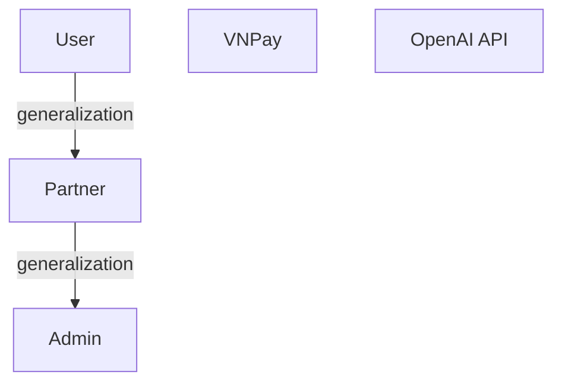

# PHÂN TÍCH GENERALIZATION GIỮA CÁC ACTORS TRONG USE CASE DIAGRAM

## TỔNG QUAN

Dựa trên code và tài liệu chức năng, phân tích xem có nên sử dụng generalization (kế thừa) giữa các actors trong Use Case Diagram hay không.

---

## 1. PHÂN TÍCH ROLE HIERARCHY TRONG CODE

### 1.1. **Role Hierarchy được định nghĩa trong SecurityConfig.java**

```java
@Bean
RoleHierarchy roleHierarchy() {
    // ADMIN has all privileges of PARTNER and USER
    // PARTNER has all privileges of USER
    // Hierarchy: ADMIN > PARTNER > USER
    return RoleHierarchyImpl.fromHierarchy(
        RoleType.ADMIN.getValue() + " > " + RoleType.PARTNER.getValue() + "\n" +
            RoleType.ADMIN.getValue() + " > " + RoleType.USER.getValue() + "\n" +
            RoleType.PARTNER.getValue() + " > " + RoleType.USER.getValue());
}
```

**Kết luận từ code:**

- ✅ **ADMIN > PARTNER**: Admin có tất cả quyền của Partner
- ✅ **ADMIN > USER**: Admin có tất cả quyền của User
- ✅ **PARTNER > USER**: Partner có tất cả quyền của User
- **Hierarchy**: ADMIN > PARTNER > USER

---

## 2. PHÂN TÍCH CHỨC NĂNG CHUNG

### 2.1. **Chức năng của User**

1. Quản lý thông tin cá nhân
2. Tìm kiếm và khám phá phòng
3. Quản lý đặt phòng (tạo, hủy, đổi lịch, thanh toán, check-in, check-out)
4. Quản lý đánh giá
5. Sử dụng Chatbot AI

### 2.2. **Chức năng của Partner**

1. Quản lý thông tin cá nhân ✅ (chung với User)
2. Quản lý khách sạn (cập nhật thông tin)
3. Quản lý phòng (tạo, cập nhật, xóa)
4. Quản lý kho phòng
5. Quản lý đặt phòng (tạo, hủy, đổi lịch, check-in, check-out, hoàn tiền, xóa) ✅ (chung với User)
6. Quản lý đánh giá ✅ (chung với User)
7. Báo cáo và phân tích khách sạn
8. Gửi yêu cầu cho quản trị viên

### 2.3. **Chức năng của Admin**

1. Quản lý người dùng và vai trò
2. Quản lý địa điểm
3. Quản lý khách sạn (tạo, cập nhật, xóa) ✅ (chung với Partner)
4. Quản lý phòng ✅ (chung với Partner)
5. Quản lý kho phòng ✅ (chung với Partner)
6. Quản lý tiện ích
7. Quản lý ngày đặc biệt
8. Quản lý khuyến mãi
9. Quản lý đặt phòng (tất cả chức năng) ✅ (chung với User và Partner)
10. Quản lý đánh giá ✅ (chung với User và Partner)
11. Báo cáo và phân tích toàn hệ thống ✅ (chung với Partner - nhưng phạm vi rộng hơn)
12. Xử lý yêu cầu từ đối tác
13. Quản lý Chatbot AI ✅ (chung với User - nhưng phạm vi rộng hơn)

**Từ tài liệu ADMIN_chuc_nang.txt (dòng 96):**

> "Quản trị viên có toàn quyền quản lý hệ thống, bao gồm tất cả chức năng của khách hàng và đối tác."

---

## 3. PHÂN TÍCH GENERALIZATION TRONG UML USE CASE DIAGRAM

### 3.1. **Generalization trong Use Case Diagram là gì?**

- **Generalization** (kế thừa) giữa actors có nghĩa là:
  - Actor con **kế thừa TẤT CẢ use cases** của actor cha
  - Actor con có thể có thêm các use cases riêng
  - Đây là quan hệ "is-a" (là một loại của)

### 3.2. **Có nên dùng Generalization không?**

#### **✅ NÊN DÙNG GENERALIZATION:**

1. **Admin → User (Generalization)**

   - **Lý do**:
     - Admin có TẤT CẢ chức năng của User
     - Admin có thể làm mọi thứ User làm, và còn nhiều hơn
     - Phù hợp với quan hệ "is-a": Admin là một loại User đặc biệt
   - **Trong code**: `ADMIN > USER`
   - **Use Cases**: Admin kế thừa tất cả use cases của User

2. **Admin → Partner (Generalization)**
   - **Lý do**:
     - Admin có TẤT CẢ chức năng của Partner
     - Admin có thể làm mọi thứ Partner làm, và còn nhiều hơn
     - Phù hợp với quan hệ "is-a": Admin là một loại Partner đặc biệt
   - **Trong code**: `ADMIN > PARTNER`
   - **Use Cases**: Admin kế thừa tất cả use cases của Partner

#### **✅ NÊN DÙNG GENERALIZATION:**

3. **Partner → User (Generalization)**
   - **Lý do**:
     - Partner có TẤT CẢ chức năng của User
     - Partner có thể làm mọi thứ User làm (quản lý thông tin cá nhân, đặt phòng, đánh giá), và còn nhiều hơn (quản lý khách sạn, phòng, kho phòng, xóa đặt phòng, hoàn tiền, báo cáo)
     - Partner có quyền xóa đặt phòng (User không có)
     - Partner có quyền quản lý khách sạn, phòng (User không có)
     - Phù hợp với quan hệ "is-a": Partner là một loại User đặc biệt (có thêm quyền quản lý khách sạn)
   - **Trong code**: `PARTNER > USER`
   - **Use Cases**: Partner kế thừa tất cả use cases của User, và có thêm các use cases riêng

---

## 4. CẤU TRÚC USE CASE DIAGRAM ĐỀ XUẤT

### 4.1. **Sơ đồ Generalization**

```
                    ┌─────────┐
                    │  User   │
                    └────┬────┘
                         │
                         │ (Generalization)
                         │
                    ┌────▼────┐
                    │ Partner │
                    └────┬────┘
                         │
                         │ (Generalization)
                         │
                    ┌────▼────┐
                    │  Admin  │
                    └─────────┘
```

**Giải thích:**

- **Partner** kế thừa từ **User** (Partner có tất cả quyền của User)
- **Admin** kế thừa từ **Partner** (Admin có tất cả quyền của Partner, và gián tiếp có tất cả quyền của User)
- **Hierarchy**: User → Partner → Admin

### 4.2. **Vấn đề với sơ đồ trên**

⚠️ **Vấn đề**: UML không hỗ trợ **multiple inheritance** (kế thừa đa cấp) trực tiếp trong Use Case Diagram.

### 4.3. **Giải pháp: Sử dụng Generalization Chain**

#### **Phương án 1: Admin kế thừa từ User, và Admin cũng có use cases của Partner**

```
                    ┌─────────┐
                    │  User   │
                    └────┬────┘
                         │
                    ┌────┴────┐
                    │         │
               ┌────▼────┐    │
               │ Partner │    │
               └─────────┘    │
                    │         │
                    │    ┌────▼────┐
                    │    │  Admin  │
                    │    └─────────┘
                    │         │
                    └────┬────┘
                         │
                    (Admin kế thừa từ cả User và Partner)
```

**Vấn đề**: UML không hỗ trợ multiple inheritance trực tiếp.

#### **Phương án 2: Tạo Base Actor (Không khuyến nghị)**

Tạo một base actor chung, nhưng điều này không phản ánh đúng kiến trúc thực tế.

#### **Phương án 3: Sử dụng Generalization Chain (KHUYẾN NGHỊ)** ⭐

```
                    ┌─────────┐
                    │  User   │
                    └────┬────┘
                         │
                         │ (Generalization)
                         │
                    ┌────▼────┐
                    │ Partner │
                    └────┬────┘
                         │
                         │ (Generalization)
                         │
                    ┌────▼────┐
                    │  Admin  │
                    └─────────┘
```

**Giải thích:**

- **Partner → User**: Partner kế thừa tất cả use cases của User
- **Admin → Partner**: Admin kế thừa tất cả use cases của Partner (và gián tiếp có tất cả use cases của User)
- **Hierarchy**: User → Partner → Admin (chuỗi kế thừa đơn giản, dễ hiểu)

#### **Phương án 4: Không dùng Generalization (Đơn giản hóa)** ⚠️

Chỉ sử dụng association (đường thẳng) giữa actors và use cases, không dùng generalization.

**Ưu điểm**: Đơn giản, dễ hiểu
**Nhược điểm**: Không phản ánh quan hệ kế thừa trong code

---

## 5. KHUYẾN NGHỊ

### 5.1. **Nên sử dụng Generalization** ✅

**Lý do:**

1. ✅ **Phản ánh đúng kiến trúc code**: Role hierarchy trong SecurityConfig.java
2. ✅ **Giảm trùng lặp**: Không cần vẽ lại các use cases của User và Partner cho Admin
3. ✅ **Dễ bảo trì**: Khi thêm use case cho User hoặc Partner, Admin tự động có use case đó
4. ✅ **Chuẩn UML**: Generalization là cách chuẩn để mô tả quan hệ kế thừa trong Use Case Diagram

### 5.2. **Cấu trúc Generalization đề xuất**

```
┌─────────────────────────────────────────────────────────────┐
│                    HOLIDATE SYSTEM                          │
│                                                             │
│  Use Cases:                                                 │
│  - Quản lý thông tin cá nhân                               │
│  - Tìm kiếm và khám phá phòng                              │
│  - Quản lý đặt phòng                                        │
│  - Quản lý đánh giá                                         │
│  - Sử dụng Chatbot AI                                       │
│  - Quản lý khách sạn                                        │
│  - Quản lý phòng                                            │
│  - Quản lý kho phòng                                        │
│  - Báo cáo và phân tích                                     │
│  - Quản lý người dùng và vai trò                            │
│  - Quản lý địa điểm                                         │
│  - Quản lý tiện ích                                         │
│  - Quản lý ngày đặc biệt                                    │
│  - Quản lý khuyến mãi                                       │
│  - Xử lý yêu cầu từ đối tác                                 │
│  - Quản lý Chatbot AI (Admin)                               │
│  - ...                                                      │
└─────────────────────────────────────────────────────────────┘
         │              │              │              │
         │              │              │              │
    ┌────┘         ┌────┘         ┌────┘         ┌───┘
    │              │              │              │
┌───▼───┐    ┌─────▼─────┐   ┌────▼────┐   ┌────▼─────┐
│ User  │    │  Partner  │   │  Admin  │   │  VNPay   │
└───┬───┘    └─────┬─────┘   └────▲────┘   └──────────┘
    │              │              │
    │              │              │
    └──────────────┴──────────────┘
            (Generalization)
    Admin kế thừa từ User và Partner
```

### 5.3. **Cách vẽ trong các công cụ UML**

#### **PlantUML:**

```plantuml
actor User
actor Partner
actor Admin
actor VNPay
actor "OpenAI API" as OpenAI

User <|-- Partner
Partner <|-- Admin

' Use cases
rectangle "Holidate System" {
    (Quản lý thông tin cá nhân) as UC1
    (Tìm kiếm và khám phá phòng) as UC2
    (Quản lý đặt phòng) as UC3
    (Quản lý đánh giá) as UC4
    (Sử dụng Chatbot AI) as UC5
    (Quản lý khách sạn) as UC6
    (Quản lý phòng) as UC7
    (Quản lý kho phòng) as UC8
    (Báo cáo và phân tích) as UC9
    (Quản lý người dùng và vai trò) as UC10
    (Quản lý địa điểm) as UC11
    (Quản lý tiện ích) as UC12
    (Quản lý ngày đặc biệt) as UC13
    (Quản lý khuyến mãi) as UC14
    (Xử lý yêu cầu từ đối tác) as UC15
    (Quản lý Chatbot AI) as UC16
    (Xử lý thanh toán) as UC17
    (Xử lý hoàn tiền) as UC18
    (Xử lý câu hỏi từ khách hàng) as UC19
    (Trả về phản hồi AI) as UC20
}

' Associations
User --> UC1
User --> UC2
User --> UC3
User --> UC4
User --> UC5

Partner --> UC1
Partner --> UC3
Partner --> UC4
Partner --> UC6
Partner --> UC7
Partner --> UC8
Partner --> UC9

Admin --> UC10
Admin --> UC11
Admin --> UC12
Admin --> UC13
Admin --> UC14
Admin --> UC15
Admin --> UC16

VNPay --> UC17
VNPay --> UC18

OpenAI --> UC19
OpenAI --> UC20
```

#### **Mermaid:**



---

## 6. KẾT LUẬN

### 6.1. **Có nên dùng Generalization?**

✅ **CÓ, NÊN DÙNG GENERALIZATION**

### 6.2. **Cấu trúc Generalization:**

1. ✅ **Partner → User**: Partner kế thừa tất cả use cases của User
2. ✅ **Admin → Partner**: Admin kế thừa tất cả use cases của Partner (và gián tiếp có tất cả use cases của User)
3. **Hierarchy**: User → Partner → Admin

### 6.3. **Lợi ích:**

1. ✅ Phản ánh đúng kiến trúc code (Role Hierarchy)
2. ✅ Giảm trùng lặp use cases
3. ✅ Dễ bảo trì và mở rộng
4. ✅ Tuân thủ chuẩn UML

### 6.4. **Lưu ý:**

- ⚠️ Một số công cụ UML có thể không hỗ trợ multiple inheritance trực tiếp
- ⚠️ Có thể cần vẽ 2 generalization arrows riêng biệt (Admin → User và Admin → Partner)
- ⚠️ Nếu công cụ không hỗ trợ, có thể mô tả bằng text hoặc comment

---

## 7. TÓM TẮT

### **Câu trả lời:**

**Có, nên sử dụng Generalization Chain: User → Partner → Admin.**

**Lý do:**

- Partner có tất cả chức năng của User (theo code và tài liệu)
- Admin có tất cả chức năng của Partner (và gián tiếp có tất cả chức năng của User)
- Role hierarchy trong code: `ADMIN > PARTNER > USER`
- Generalization chain giúp giảm trùng lặp và phản ánh đúng kiến trúc

### **Cấu trúc đề xuất:**

```
User
  │ (Generalization)
  ▼
Partner
  │ (Generalization)
  ▼
Admin
```

**Hierarchy**: User → Partner → Admin
